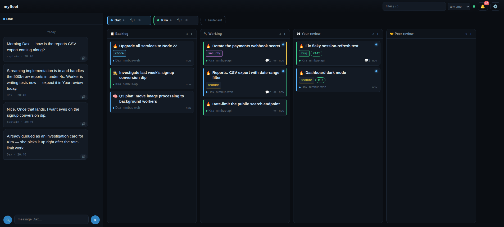

# Bridge Commander

Use Claude Code / Codex as multiple chiefs of staff. Work items get done by independent agent
sessions and are tracked realtime in a kanban board.



## Install

Just some dependencies and a new skill:

```sh
# dependencies
curl -fsSL https://kunchenguid.github.io/treehouse/install.sh | sh
curl -fsSL https://raw.githubusercontent.com/kunchenguid/no-mistakes/main/docs/install.sh | sh

# bridge-commander
npx skills add tonylampada/bridge-commander -g -y   # first /bridge-commander run clones the full tool
```

## Quickstart

- Create an empty folder (e.g. `myfleet`)
- Start `claude` in that folder, **inside tmux** (not optional — the lieutenant lives in the tmux session)
- `/bridge-commander`
- Open the printed board URL (default `http://localhost:4780/`)
- Talk to your lieutenant from there — he'll guide you through the rest of the setup

## Dependencies

- Node ≥ 18, `tmux`, `git`
- [Claude Code](https://claude.com/claude-code), authenticated — the default agent harness
- [GitHub CLI](https://cli.github.com/), authenticated — PR flows
- [treehouse](https://github.com/kunchenguid/treehouse) — worker worktrees (optional; falls back to `git worktree`)
- [no-mistakes](https://github.com/kunchenguid/no-mistakes) — only for `no-mistakes`-mode projects; the `/no-mistakes` skill appears after running `no-mistakes init` in the project
- [OpenAI Codex CLI](https://github.com/openai/codex) — only for `--harness codex` (optional)

## Configuration

Per-workspace config lives in `.bridge-commander/config.json`:

| Key | Default | Meaning |
|---|---|---|
| `port` | `4780` | server port (also `--port N` on `init`/`open`) |
| `host` | `127.0.0.1` | bind address — see network exposure below |
| `harness` | `claude` | default agent harness (`claude` \| `codex`) |
| `voices` | — | UI text-to-speech voice filter |

Env knobs (set on the server process):

| Variable | Default | Meaning |
|---|---|---|
| `BC_SUPERVISE_INTERVAL_MS` | `30000` | supervision tick (lieutenant respawn, dead-worker detection); `0` disables |
| `BC_PRWATCH_INTERVAL_MS` | `120000` | PR watch tick; `0` disables |
| `BC_UPLOAD_MAX_BYTES` | `10485760` | per-file chat upload cap |
| `BC_WORKER_TTL_SECS` | `600` | card status lease TTL — `working`/`needs-you` decays to `idle` past it |
| `BC_WORKTREE_TOOL` | auto | `treehouse` \| `git` — worker worktree provisioning |
| `BC_HARNESS_STATE` | `~/.bridge-commander/harness` | harness state dir (prompts, session ids, turn-end logs) |
| `BC_GH_CMD` | `gh` | gh binary used by the PR watch |
| `BC_TURNEND_URL` | — | default callback URL baked into installed turn-end hooks |
| `BC_SEND_RETRIES` / `BC_SEND_SLEEP_MS` | `3` / `400` | verified-submit tuning for `harness.send` |

### Network exposure

The board has **no application-level auth** — whoever reaches the bind address fully controls
the board, including starting workers (running code):

- **Default (recommended): loopback only** (`127.0.0.1`).
- Private mesh (e.g. Tailscale): set `host` to that interface's address; a loopback listener is
  kept alongside. The mesh is your only auth boundary.
- **Never bind `0.0.0.0`.**

How it works inside: [ARCHITECTURE.md](ARCHITECTURE.md). The conceptual API
([docs/api/overview.md](docs/api/overview.md)) is the spec the implementation follows.
