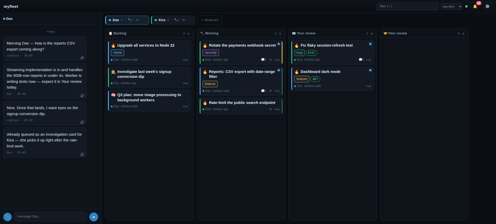

# Bridge Commander

<p align="center">
  <a href="https://youtu.be/CfJs03Jyum0">
    
  </a>
</p>

As you work with AI, your **attention gets fragmented** — driving multiple planning tasks while
overseeing multiple implementation tasks. Chat quickly becomes the wrong UX for piloting a fleet
of agents.

This skill lets you use Claude Code / Codex as multiple chiefs of staff (**lieutenants**). You
get a web UI where you work together, as work items get done by independent agent sessions on a
kanban board.



## Install

One skill:

```sh
npx skills add tonylampada/bridge-commander -g -y
```

That is the whole install. The rest happens in the terminal you already have.

## Start

- Make an empty folder (e.g. `myfleet`) and start `claude` in it
- `/bridge-commander`
- Open the board URL it prints (default `http://localhost:4780/`)

**Bridget** is already there with a message waiting. She's your first lieutenant, and she does the
rest of the setup with you — the two optional tools, your first repo, and a short checklist that
runs as real cards on the board.

You need `tmux` and `git` on the machine (your agent will offer to install `tmux` if it is
missing). You never have to use tmux yourself.

Two things worth knowing before you start, because they are the only ways a first run stops early:

- **Run `claude` once by hand, inside the workspace folder**, if this machine has never run it.
  It has setup screens a spawned session cannot answer for you — a theme picker, a login, and a
  trust question about that specific folder (which is why running it in your home directory is not
  enough).
- **Not as root.** Claude Code refuses `--dangerously-skip-permissions` as root, so a lieutenant
  cannot start there. Use a normal user (a throwaway container can pass `--allow-root`, and the
  tool will tell you what that costs). If you need to install Claude Code as that user,
  `curl -fsSL https://claude.ai/install.sh | bash` puts it in `~/.local/bin` without root.

## Board views

The board region has three modes, toggled next to the filter (▦ / ☰ / 🧊):

- **▦ board** — the kanban, as always.
- **☰ table** — every live card as a sortable row (status, owner, labels, PRs,
  activity…); same cards, same filters, denser reading.
- **🧊 archived** — a read-only browser over the archive (the append-only log of
  frozen card snapshots), newest first, paged in on demand. Clicking a row opens
  the regular card detail — body, timeline, frozen thread — where **unarchive**
  restores the card to the live board.

Filtering is one shared control across all three: the topbar text input plus the
funnel popup (status / type / owner / label / updated — every dimension
multi-select, OR within a dimension, AND across). Clicking a label or owner
anywhere toggles it as a filter chip; the funnel badge counts what's active.

### UI dev playground

`node dev/ui-server.js` (default `127.0.0.1:4790`, `--port`/`--host` flags)
serves the real `ui/` against an in-memory fixture board from `dev/fixtures/` —
every endpoint faked, writes mutate and re-broadcast, nothing persists. Iterate
on the UI with realistic gnarly states (dead lieutenants, giant cards, a
paginated archive) without touching a live workspace.

## Playbooks — how you ask for work

The brief a worker is launched with is rendered from a markdown file you own, in
`.bridge-commander/playbooks/`. One file per playbook, and the file name is its id:

| playbook | is |
|---|---|
| `default` | implement, commit, ship it the way the project allows |
| `no-mistakes` | the same, behind a review-and-CI gate |
| `investigation` | no branch, no PR — a written report |

Every card points at one (the dropdown in the new-card modal, `--playbook <id>` on the CLI), and
`card start` renders it against the card **as it stands at that moment** — title, body, thread
and attributes, through `{{CARD_TITLE}}`, `{{TASK}}`, `{{THREAD}}`, `{{ATTR_<NAME>}}` and the
rest, all listed in the folder's own README. Sharpen the body a second before starting and the
worker reads the sharpened one.

A playbook may also open with a small frontmatter block naming how the card runs — `harness`,
`model`, `requires` (attributes it cannot start without), `branch`, `keep_worktree` (never
release the checkout automatically, for a card reworked in place), `teardown` (a command that
stops what the run started, just before the checkout goes) — all optional, all in
[playbooks/README.md](playbooks/README.md).

They are **yours**. Edit one and the next card started on it uses the edit — no restart, no
release. Add a file and it is in the dropdown. The copies shipped here only seed a fresh
workspace; a file in `.bridge-commander/playbooks/` always wins, so upgrading never overwrites
what you wrote. A card with no playbook does not start, and nothing picks one for it.

## Dependencies

- Node ≥ 18, `tmux`, `git`
- [Claude Code](https://claude.com/claude-code), authenticated — the default agent harness
- [GitHub CLI](https://cli.github.com/), authenticated — PR flows
- [treehouse](https://github.com/kunchenguid/treehouse) — worker worktrees (optional; falls back to `git worktree`)
- [no-mistakes](https://github.com/kunchenguid/no-mistakes) — only for cards on the `no-mistakes` playbook; the `/no-mistakes` skill appears after running `no-mistakes init` in the project
- [OpenAI Codex CLI](https://github.com/openai/codex) — only for `--harness codex` (optional)

## Configuration

Per-workspace config lives in `.bridge-commander/config.json`:

| Key | Default | Meaning |
|---|---|---|
| `port` | `4780` | server port (also `--port N` on `init`/`open`) |
| `host` | `127.0.0.1` | bind address — see network exposure below |
| `harness` | `claude` | default agent harness (`claude` \| `codex`) |
| `voices` | — | UI text-to-speech voice filter |
| `tts` | — | speak through an external TTS engine instead of the browser: `{"url": "http://127.0.0.1:8883", "lang": "pt", "voice": null, "params": {}}` (voxbench API). Absent = the browser's own voice; any engine failure falls back to it. The **browser** calls the engine, so the url must be reachable from wherever the board is open and the engine must allow that origin (CORS) |

Env knobs (set on the server process):

| Variable | Default | Meaning |
|---|---|---|
| `BC_SUPERVISE_INTERVAL_MS` | `30000` | supervision tick (lieutenant respawn, dead-worker detection); `0` disables |
| `BC_PRWATCH_INTERVAL_MS` | `120000` | PR watch tick; `0` disables |
| `BC_UPLOAD_MAX_BYTES` | `10485760` | per-file chat upload cap |
| `BC_WORKER_TTL_SECS` | `600` | card status lease TTL — `working`/`needs-you` decays to `idle` past it |
| `BC_WORKTREE_TOOL` | auto | `treehouse` \| `git` — worker worktree provisioning |
| `BC_HARNESS_STATE` | `~/.bridge-commander/harness` | harness state dir (prompts, session ids, turn-end logs) |
| `BC_GH_CMD` | `gh` | gh binary used by the PR watch |
| `BC_TURNEND_URL` | — | default callback URL baked into installed turn-end hooks |
| `BC_SEND_RETRIES` / `BC_SEND_SLEEP_MS` | `3` / `400` | verified-submit tuning for `harness.send` |
| `BC_HOOK_TIMEOUT_MS` | `120000` | per-script timeout for workspace hooks, lifecycle and named alike |
| `BC_TEARDOWN_TIMEOUT_MS` | `300000` / `60000` | timeout for a playbook's `teardown` command — 5 min at the handoff and archive (un-awaited), 60s at a rework restart (awaited inside `card start`); set, it overrides both |
| `BC_SYSLOAD_MS` | `2000` | monitoring panel (⚙️ → machine load) sample interval; the sampler runs only while the panel is open |

### Hooks

A hook is an executable file the workspace owns, and where it sits says what fires it:

```
.bridge-commander/hooks/worker-done/sweep.sh   a LIFECYCLE hook — that event fires it
.bridge-commander/hooks/gh-watch               a NAMED hook — nothing fires it but you
```

**Directory means event, file means name.** Both are spawned directly (cwd = workspace root)
with context in env — `BC_EVENT`, `BC_CARD`, `BC_REPO`, `BC_WORKTREE`, `BC_BRANCH`. Lifecycle
events: `worker-done`, `worker-died`, `card-archived` (fires before the worktree is released —
and `BC_WORKTREE` is empty when the handoff released it already, which is the usual case).
Lifecycle hooks are fire-and-forget — a failure or timeout never blocks the lifecycle; results
land on the card timeline (`hook-ran` / `hook-failed`).

There is no hook API: a hook is bash with `bc-axi` on its `PATH` (appended, so a `bc-axi` you
put there yourself still wins — the board makes its CLI reachable, it does not take the name),
so it wakes a lieutenant the
way anything else does — `bc-axi event <card> --wake-owner`. Add `--key <s>` and a five-minute
poll seeing the same red check wakes that lieutenant once instead of sixty times (keys are
per-card, kept 7 days); `--source <n>` says who woke them, on the timeline and in the drain.

```sh
bc-axi hook list                       # every hook, and how its last run ended
bc-axi hook run gh-watch               # run a named one — the same door the board's ▶ posts to
bc-axi hook runs gh-watch              # its trace

# writing one: a hook nobody wrote yet reads as empty at version "", and "" is
# what the write reads as "there is no file yet", so this creates it (executable)
f=file://$PWD/.bridge-commander/hooks/gh-watch
bc-axi artifact read $f                # empty, `version:` blank on stderr
bc-axi artifact write $f --file draft.sh --version ''
```

`hook run` is the ONE door: an outside trigger already running on this machine, the board's ▶
and (later) a schedule all come through it. One run per hook name at a time — a second call
while the first is in flight is refused, naming the one going.

Every run of either kind appends a line to `.bridge-commander/hookruns.jsonl` — hook, trigger,
card, when, how long, exit code, timed-out flag, output tail. `hook runs` reads it off the
tail. The config screen's **hooks** tab shows the same thing as one row per hook, with ✎ to edit
one in the board's file editor and ▶ to run a named one — on a lifecycle row ▶ is disabled, since
its event is what fires it and a hand-run would hand a card-shaped script no card.

To tear down infrastructure one **playbook** starts (a dev container, a compose stack), reach
for that playbook's `teardown` key instead: the command runs in the worktree immediately
before it is released, and lives beside the thing that started it rather than in a hook that
has to recognise which cards it applies to.

### Network exposure

The board has **no application-level auth** — whoever reaches the bind address fully controls
the board, including starting workers (running code):

- **Default (recommended): loopback only** (`127.0.0.1`).
- Private mesh (e.g. Tailscale): set `host` to that interface's address; a loopback listener is
  kept alongside. The mesh is your only auth boundary.
- **Never bind `0.0.0.0`.**

How it works inside: [ARCHITECTURE.md](ARCHITECTURE.md). The conceptual API
([docs/api/overview.md](docs/api/overview.md)) is the spec the implementation follows.
